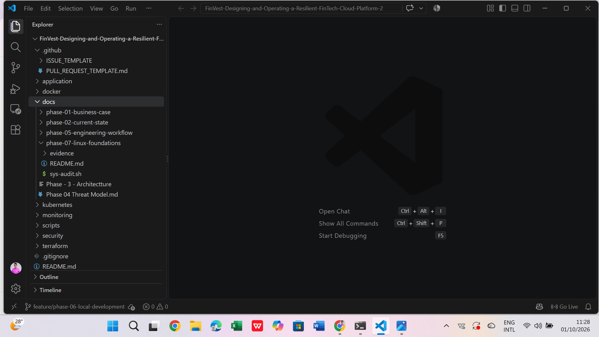
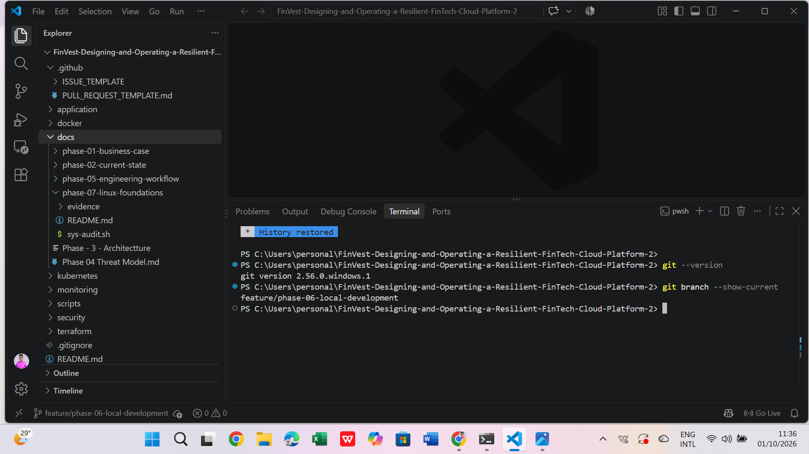
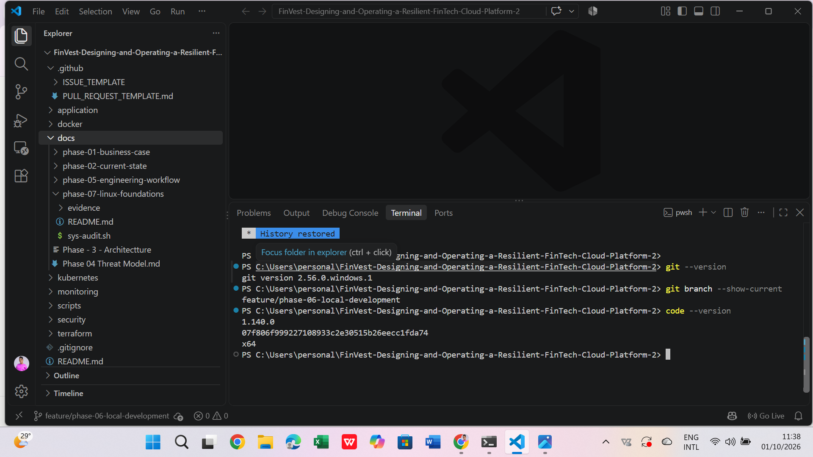
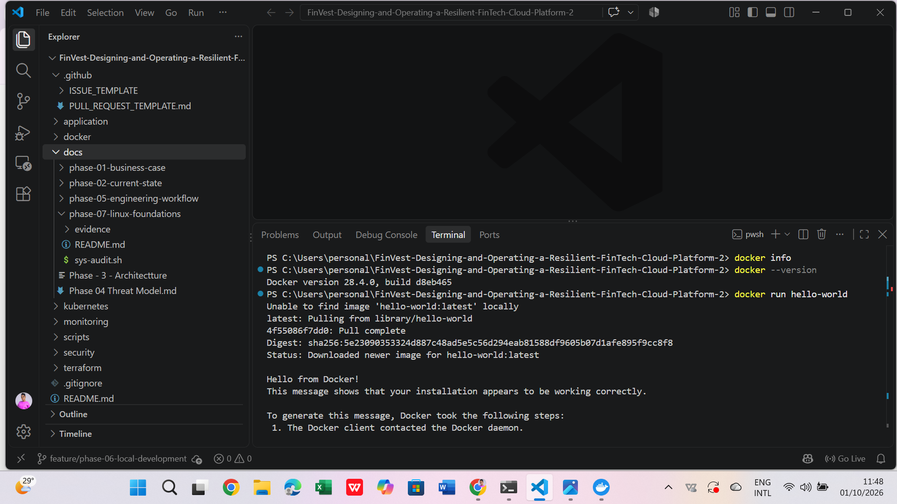

# Phase 6: Local Development Environment

**Status:** Complete
**Verified:** 2026-10-01
**Branch:** `feature/phase-06-local-development`

## Transformation chain

| Stage | Detail |
|---|---|
| **Business problem** | An undocumented, unverified workstation produces "works on my machine" failures, slow onboarding and unreproducible results. Every later FinVest phase (Linux, Terraform, Docker, Kubernetes, CI/CD) depends on a known-good local toolchain. |
| **Engineering requirement** | A documented, version-pinned, verified local toolchain, operating from a single authoritative working copy of the repository on a feature branch. |
| **Technical decision** | Git + VS Code on Windows 11, Docker Desktop on the WSL2 backend. Tools are verified by command output, not assumed. Tools needed by later phases (AWS CLI, Terraform, kubectl, Helm) are installed in the phase that first requires them. |
| **Implementation** | Repository cloned and opened in VS Code on `feature/phase-06-local-development`. Git, VS Code CLI and Docker verified from the integrated terminal. |
| **Testing** | Version checks for each tool, plus `docker run hello-world` to prove the container engine can pull and run an image end to end. |
| **Evidence** | Screenshots 01-04 in `evidence/`. |
| **Result** | Workstation verified and reproducible from this document. Docker engine confirmed operational ahead of Phase 13. |

## Verified toolchain

| Tool | Version | Verification command |
|---|---|---|
| Operating system | Windows 11 | n/a |
| Git | 2.56.0.windows.1 | `git --version` |
| Visual Studio Code | 1.140.0 (x64) | `code --version` |
| Docker (client and engine) | 28.4.0 | `docker --version`, `docker info` |
| Docker Compose | v2.39.4-desktop.1 | `docker info` (plugins) |
| Docker engine backend | WSL2 (kernel 6.6.87.2-microsoft-standard-WSL2), 4 CPUs, 7.7 GiB RAM | `docker info` |

The Docker Desktop application version was not captured during this verification.

## Verification procedure

Run from the integrated VS Code terminal in the repository root, one command at a time:

```powershell
git --version
git branch --show-current
code --version
docker --version
docker info
docker run hello-world
```

Expected results: a Git version string, `feature/phase-06-local-development`, a VS Code version with commit hash, a Docker version, a populated `Server:` block from `docker info`, and "Hello from Docker!".

## Evidence

### 1. Repository open on the Phase 6 feature branch

Proves the repository is cloned, open in the IDE, and being worked on a feature branch rather than `main`.



### 2. Git verification

Proves Git is installed (2.56.0.windows.1) and the active branch is `feature/phase-06-local-development`.



### 3. VS Code CLI

Proves the `code` command is on PATH (VS Code 1.140.0, x64).



### 4. Docker engine

Proves the Docker engine can pull and run a container (Docker 28.4.0), a prerequisite for Phase 13.



## Incidents and troubleshooting log

Real issues hit during this phase, kept because the diagnosis is the useful part.

### 1. Failed clones caused by a Windows-invalid path

- **Symptom:** Three local clone folders existed. Two reported every file as staged-deleted (`D`) in `git status`, with almost no files on disk.
- **Root cause:** A folder on GitHub (`Phase 3 `) had a trailing space. Windows cannot create such paths, so checkout failed after Git had already written its index.
- **Diagnosis:** `git status --short`, `git branch --show-current`, and a file count per folder separated the healthy clone from the broken ones.
- **Resolution:** The path was corrected on GitHub; one clean working copy was kept.
- **Risk avoided:** Committing from a failed clone would have recorded a commit deleting the entire repository.
- **Prevention:** Phase documentation folders follow `phase-XX-name` with no spaces. Remaining non-conforming names are tracked for a cleanup PR.

### 2. Feature branch carried commits from a later phase

- **Symptom:** `feature/phase-06-local-development` pointed at Phase 7 commits.
- **Diagnosis:** `git log --oneline --graph --all`, `git diff --stat main..HEAD`, and `git branch -r --contains <sha>` showed the commits were already preserved on `origin/develop`.
- **Resolution:** The branch was re-pointed at `origin/main` after confirming no work could be lost and the tree was clean.
- **Lesson:** Run `git fetch origin` before drawing conclusions. A stale remote-tracking ref made local `main` look ahead of GitHub when it was actually behind.

### 3. Docker commands failed with `error during connect`

- **Symptom:** `docker --version` worked; `docker run hello-world` failed on the `dockerDesktopLinuxEngine` named pipe.
- **Root cause:** The `docker` command is only a client. Docker Desktop (and therefore the engine) was not running.
- **Diagnosis order:** `docker --version` (client present?) then `docker info` (server reachable?) then start Docker Desktop.
- **Resolution:** Started Docker Desktop; `docker info` returned a full `Server:` block and `hello-world` succeeded.
- **Production note:** On Linux servers the engine runs as a system service (`systemctl status docker`); the dependency on a desktop application is specific to developer workstations.

## Security notes

- The `origin` remote is a plain HTTPS URL with no embedded credentials. Authentication goes through Git Credential Manager.
- No secrets, tokens or keys were created or committed in this phase.
- Branch work stays on feature branches and reaches `main` only through pull requests.

## Out of scope for this phase

AWS CLI, Terraform, kubectl and Helm are not installed here. Each is installed and verified in the phase that first needs it (AWS CLI in Phase 8, Terraform in Phase 10, Kubernetes tooling from Phase 15).

## Note on sequencing

Phase 7 work (Linux foundations) was merged to `main` before this verification was recorded. The dates above are the date this environment was verified, not an implication that the phases were completed in numeric order.

## Next

Phase 7: Linux Foundation (WSL2 / Ubuntu).